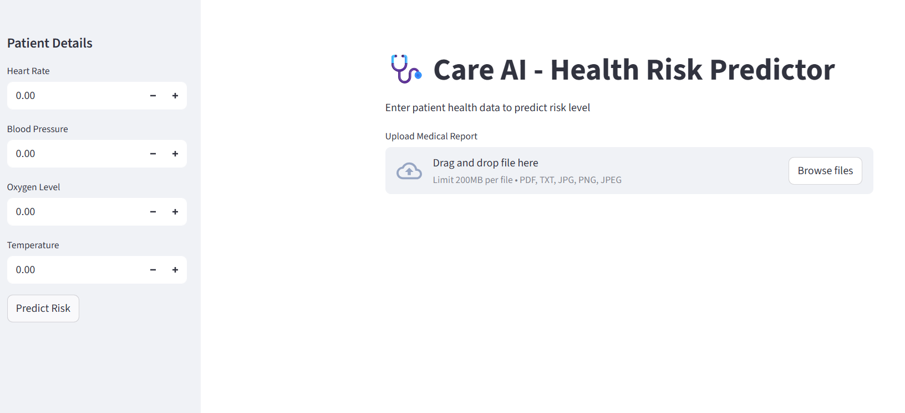
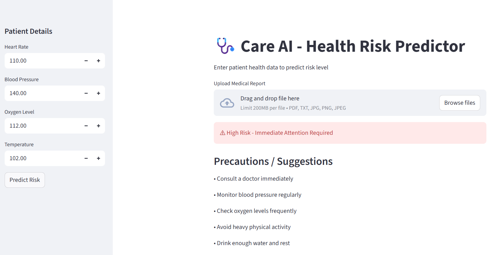
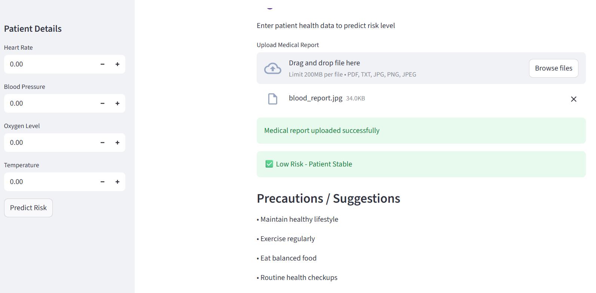

# Care AI – Health Risk Predictor

## Overview

Care AI is a machine learning-based application that predicts the health risk level of a patient using vital parameters such as heart rate, blood pressure, oxygen level, and temperature.

## Project Screenshots

### Interface

### High Risk Prediction

### Low Risk Prediction

## Features

* Patient health data input
* Medical report upload (PDF, TXT, JPG, PNG)
* AI-based risk prediction
* Health precaution suggestions

## Technologies Used

* Python
* Streamlit
* Machine Learning (Random Forest)
* Pandas
* Scikit-learn

## How to Run

1. Clone the repository:

git clone https://github.com/Ashrith59/care-ai-health-risk-predication.git

2. Navigate to the project folder:

cd care-ai-health-risk-predication

3. Install dependencies:

pip install streamlit pandas scikit-learn

4. Train the model:

python train_model.py

5. Run the application:

streamlit run app.py

## GitHub Repository

https://github.com/Ashrith59/care-ai-health-risk-predication

## Project Structure

* app.py → Streamlit web interface
* train_model.py → Model training script
* health_data.csv → Dataset
* model.pkl → Trained ML model

## Author

Ashrith
